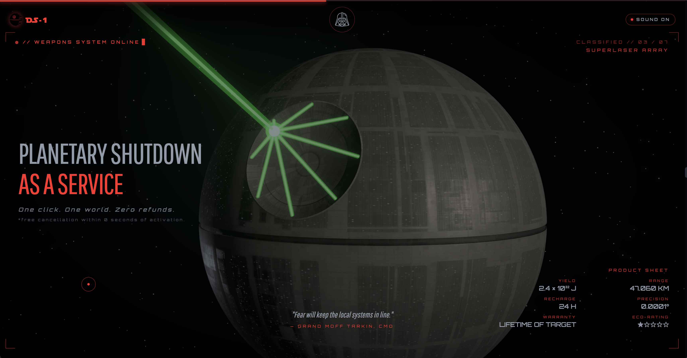

# Star Wars Scrollytelling — DS-1 Experience

> _Planetary shutdown as a service. One click. One world. Zero refunds._

🔗 **Live demo:** https://www.edoedoedo.it/experiments/death-star-promo/



A scrollytelling experiment in the style of an Imperial product page:
classic opening crawl, an **ironic brochure for the DS-1** ("Orbital Battle
Station"), and an AI chat ("Master Lucas") that answers Star Wars questions
using SWAPI as its knowledge base.

Six scroll-driven narrative phases:

1. **Engage / Crawl** — entry screen + yellow opening crawl.
2. **Superlaser** — "Planetary Shutdown as a Service" brochure with stats and quote.
3. **Hyperspace** — jump to hyperspace and arrival of the battle group.
4. **Crew / Hologram** — holographic projector featuring 5 crew members.
5. **Schematic** — Yavin 4 CRT terminal showing the DS-1 schematic.
6. **Lightsaber** — ignition + "Book a test drive" CTA.

## Stack

- **Vite + React 18 + TypeScript**
- **@react-three/fiber + drei** — 3D scene, environment, post-processing
- **lenis** — smooth scroll
- **gsap + ScrollTrigger** — scrub timelines, clip-path wipes
- **zustand** — shared state (loader, scrollProgress, menuOpen, chatOpen, per-section progress)
- **Tailwind CSS** — "Sith" theme (black / red / steel)
- **Groq API (Llama 3.3 70B)** — AI chat
- **SWAPI** (https://swapi.info) — canonical Star Wars data

## Setup

```bash
npm install
cp .env.example .env.local
# add your Groq API key → https://console.groq.com/keys
npm run dev
```

Open http://localhost:5173.

## Structure

```
src/
  App.tsx                       # composition + header + overlay mounting
  main.tsx                      # entry
  index.css                     # tailwind + themes (saber, crawl, panels, vader-breath)
  store/useAppStore.ts          # zustand: loading, scrollProgress, menuOpen, chatOpen, section progress
  hooks/useLenisScroll.ts       # Lenis ↔ GSAP ScrollTrigger
  three/
    Scene.tsx                   # fixed R3F Canvas, CameraRig driven by scrollProgress
    DeathStar.tsx               # DS-1 model
    FighterFlyby.tsx            # X-Wing / TIE / Falcon / Shuttle flybys
    Hyperspace.tsx              # hyperspace streaks + boom
    HoloRoom.tsx                # holographic room + projector puck
    Superlaser.tsx              # green converging beam
    Lightsaber.tsx              # lightsaber (Vader)
  components/
    icons/
      VaderIcon.tsx             # inline SVG (currentColor)
    Loader.tsx                  # ignition lightsaber loader
    EngageScreen.tsx            # initial gate + audio unlock
    OpeningCrawl.tsx            # classic yellow crawl
    HeroReveal.tsx              # "That's no moon"
    FeatureSuperlaser.tsx       # phase 2 scroll-driver + SuperlaserHUD
    FeatureHyperspace.tsx       # phase 3 scroll-driver + HyperspaceHUD
    FeatureHologram.tsx         # phase 4 scroll-driver + HoloHUD
    FeatureBlueprint.tsx        # phase 5 scroll-driver + BlueprintCRT
    FeatureLightsaber.tsx       # phase 6 scroll-driver + LightsaberHUD
    BlueprintCRT.tsx            # green-phosphor terminal
    FullscreenMenu.tsx          # fullscreen menu with top-down clip wipe
    LucasChatModal.tsx          # AI chat modal
    MuteToggle.tsx              # inline header audio toggle
    ScrollProgressBar.tsx       # sticky red bar at the top
    ScrollHint.tsx              # tiny scroll wheel hint
    Cursor.tsx                  # custom cursor
    MagneticButton.tsx          # reusable "magnetic" button
  lib/
    swapi.ts                    # SWAPI client
    groq.ts                     # Groq client + system prompt + SWAPI tool
    audio.ts                    # AudioManager singleton (load / trigger / loop)
```

## "HUD" sections

Each `Feature*` is an empty container acting as a scroll-driver
(`ScrollTrigger` with `scrub`) that maps the scroll within the section to a
`0..1` value in the store (`superlaserProgress`, `hologramProgress`, etc.).
The matching HUDs (`SuperlaserHUD`, `HoloHUD`, `LightsaberHUD`, ...) are
fixed overlays that read that value and animate text/elements with `gsap` or
inline styles.

Visual transitions between sections use animated `clipPath: inset(...)` on
"wipe" panels (e.g. Blueprint, FullscreenMenu) to stay consistent with the
Imperial-CRT language.

## Header & menu

- **DS-1 logo** (left) → clickable, scrolls to top.
- **Vader button** (center) → opens the fullscreen menu, with a slow red
  "breath" animation when idle.
- **Sound toggle** (right) → unlocks/silences all audio.

The fullscreen menu:

- Opens with a top-down clip-path wipe + a red sweep line (reuses the
  `blu-turn` sound).
- Shows the same nav entries (REVEAL / SUPERLASER / CREW / BLUEPRINT /
  IGNITE).
- **Highlights the active section in red** based on the current scroll
  position.
- Provides an "OPEN HOLOCRON" shortcut at the bottom for the chat.
- `Esc` or the X at the top to close.

## Master Lucas — AI chat

The "OPEN HOLOCRON" / Vader-menu shortcut opens a chat with **Master
Lucas**, an AI persona that answers questions about the Star Wars universe
in a slightly grandiose, in-character tone.

How it works:

- **LLM** — [Groq](https://console.groq.com/) hosts Llama 3.3 70B; calls go
  through a tiny PHP proxy in [`api/groq.php`](api/groq.php) so the API key
  is never exposed to the browser. The system prompt lives in
  [`src/lib/groq.ts`](src/lib/groq.ts).
- **Knowledge grounding** — instead of relying solely on the model's
  training, the chat runs a lightweight keyword-based retrieval step
  (`gatherSwapiContext` in [`src/lib/groq.ts`](src/lib/groq.ts)): the user
  message is matched against a set of regex patterns to detect intents
  (planets, films, characters, starships, vehicles, species), the relevant
  canonical records are fetched from [SWAPI](https://swapi.info) via
  [`src/lib/swapi.ts`](src/lib/swapi.ts), and the results are injected into
  the system prompt as grounding context before the model answers. This
  keeps answers anchored to canon and reduces hallucinations. (Note: this
  is prompt-side RAG, not LLM function/tool calling.)
- **UI** — [`src/components/LucasChatModal.tsx`](src/components/LucasChatModal.tsx)
  is a fullscreen modal in the same Imperial-CRT visual language as the
  rest of the site (red/steel palette, scanlines, Orbitron/VT323 typography).

### Running the chat locally

1. Create a free account on [Groq Console](https://console.groq.com/) and
   generate an API key.
2. Configure it server-side (the browser never sees the key):

    ```bash
    cp api/config.example.php api/config.php
    # edit api/config.php → set GROQ_API_KEY = 'gsk_...'
    ```

3. Make sure the PHP proxy in [`api/`](api/) is reachable at
   `/api/groq.php`. In production it's served by Aruba's PHP runtime; in
   local dev you can use the built-in PHP server alongside Vite:

    ```bash
    php -S localhost:8000 -t .
    # then visit http://localhost:5173 — the proxy is at http://localhost:8000/api/groq.php
    ```

    Adjust the fetch URL in [`src/lib/groq.ts`](src/lib/groq.ts) if your
    local setup differs.

Without a valid `GROQ_API_KEY` the rest of the experience works normally —
only the Holocron chat will return an error.

## Fonts

| Usage                        | Font               | Source                                                                                                  |
| ---------------------------- | ------------------ | ------------------------------------------------------------------------------------------------------- |
| "DS-1" logo, crawl titles    | **Star Jedi**      | [dafont](https://www.dafont.com/star-jedi.font) — free for personal use, self-hosted in `public/fonts/` |
| Opening crawl body           | Pathway Gothic One | Google Fonts                                                                                            |
| Display UI (specs, headings) | Orbitron           | Google Fonts                                                                                            |
| Body                         | Inter              | Google Fonts                                                                                            |
| HUD (typewriter)             | VT323              | Google Fonts                                                                                            |

The **Star Jedi Hollow** (outline) and **Star Jedi SE** (special edition,
different glyphs) variants are also bundled and usable as `font-jediHollow` /
`font-jediSe`.

> Star Jedi is the font used for the **Star Wars logo** itself (the chrome
> letters). The yellow film crawl originally used **News Gothic Bold**;
> Pathway Gothic One is the closest open-source substitute.

## 3D Models — Credits

All models are sourced from Sketchfab. This project is **non-commercial /
portfolio use only**. Sketchfab links are provided for CC BY 4.0 assets;
NC-ND assets are credited but not linked here (please search Sketchfab
directly if you wish to download them and respect their license).

| Model                   | Author             | License         | Sketchfab                                                                                                  |
| ----------------------- | ------------------ | --------------- | ---------------------------------------------------------------------------------------------------------- |
| Death Star (4K)         | SebastianSosnowski | CC BY-NC-ND 4.0 | —                                                                                                          |
| Darth Vader Helmet      | JJTale             | CC BY 4.0       | [link](https://sketchfab.com/3d-models/darth-vader-helmet-7c49aaf5121643189a4ac40fdfd0a35b)                |
| Darth Vader Lightsaber  | mrpanini.yt        | CC BY 4.0       | [link](https://sketchfab.com/3d-models/darth-vader-lightsaber-19e49786dead45749ba5c153f89063d2)            |
| Stylized X-Wing         | Alexander Günther  | CC BY 4.0       | [link](https://sketchfab.com/3d-models/stylized-x-wing-645505dd04f9401390d942ec278fb4e0)                   |
| TIE/ln Fighter          | Daniel (Andersson) | CC BY 4.0       | [link](https://sketchfab.com/3d-models/star-wars-tieln-fighter-79d9403f15334c129ea5454daffe6b5c)           |
| Millennium Falcon       | Yehor.Yanush       | CC BY-NC-ND 4.0 | —                                                                                                          |
| Star Destroyer          | rubaun             | CC BY 4.0       | [link](https://sketchfab.com/3d-models/star-destroyer-aaa18e14129a461c839877389bd28504)                    |
| Lambda Imperial Shuttle | tegnemaskin        | CC BY 4.0       | [link](https://sketchfab.com/3d-models/star-wars-lambda-imperial-shuttle-4db774b7ea41489ca7bb683ed0f0b60a) |
| Storm Trooper           | CODAME             | CC BY 4.0       | [link](https://sketchfab.com/3d-models/storm-trooper-1e8f5aa7bdc941f9b27ddb5b6dedb058)                     |
| K-2SO                   | Drigui             | CC BY 4.0       | [link](https://sketchfab.com/3d-models/k2so-1c43315a73a4436589b23b60bb846528)                              |
| R5-J2 Astromech Droid   | Hunter Wiltse      | CC BY 4.0       | [link](https://sketchfab.com/3d-models/r5-j2-imperial-astromech-droid-2d1bf74e06a347449a20c8f2181aac78)    |
| Mouse Droid (MSE-6)     | LarsH.             | CC BY 4.0       | [link](https://sketchfab.com/3d-models/star-wars-mouse-droid-bc78bbf16cf74d2580980e3123458348)             |
| B1 Battle Droid         | tegnemaskin        | CC BY 4.0       | [link](https://sketchfab.com/3d-models/star-wars-b1-battle-droid-ade3a1205cce449caf91f78e595e5676)         |
| Holo-Puck               | thekaz.2128        | CC BY 4.0       | [link](https://sketchfab.com/3d-models/holo-puck-4b8be9e0e41d4611a99e9641ee0f83f0)                         |

The original source files live in `assets-source/models/` (excluded from the
bundle). The web-served versions in `public/models/` are optimized with
[`gltf-transform`](https://gltf-transform.dev/) (mesh quantization via
**meshopt** + **WebP** texture compression).

### Re-compressing the models

```bash
npx @gltf-transform/cli optimize \
  assets-source/models/death_star_-_star_wars.glb \
  public/models/death_star_hd_opt.glb \
  --compress meshopt --texture-compress webp
```

To use **Draco** (smaller meshes, slightly heavier decoder) replace
`--compress meshopt` with `--compress draco`, and in
[`DeathStar.tsx`](src/three/DeathStar.tsx) use
`useGLTF.setDecoderPath('/draco/')` with the Draco decoders copied from
`node_modules/three/examples/jsm/libs/draco/`.

## Audio — Credits

All clips in `public/sounds/` are used for demonstration / parody purposes.
The original sound rights belong to **Lucasfilm Ltd.** (fair use,
non-commercial).

| File                                                                      | Usage                             |
| ------------------------------------------------------------------------- | --------------------------------- |
| `imperial-march.m4a`                                                      | ambient                           |
| `vader-breath.m4a`                                                        | loader / engage loop              |
| `hyperspace_1.m4a` / `_2.m4a`                                             | warp loop + boom                  |
| `superlaser.m4a`                                                          | superlaser fire                   |
| `star-destroyer-alarm.m4a`                                                | Star Destroyer alarm              |
| `tie_fighter.m4a` / `x-wing.m4a` / `millenium-falcon.m4a` / `shuttle.m4a` | flyby                             |
| `tie-shoot.m4a`                                                           | TIE shot                          |
| `holo-bg.m4a` / `holo-turn.m4a` / `holo-switch.m4a`                       | holographic projector             |
| `blu-bg.m4a` / `blu-turn.m4a`                                             | blueprint CRT + menu open/close   |
| `darth_vader_lightsaber.m4a`                                              | lightsaber ignition / hum / close |

## Icons

| Icon               | Source                                                                     |
| ------------------ | -------------------------------------------------------------------------- |
| Darth Vader helmet | [Icons8](https://icons8.com/icons/set/darth-vader) — free with attribution |
| Death Star logo    | Custom SVG in `public/death-star.svg`                                      |

## SEO / Open Graph

`index.html` includes `og:*` and `twitter:*` meta tags for link previews
(title, description, image, theme-color). The OG image is currently the
Death Star SVG; for a full-quality preview across all platforms, generating
a dedicated 1200×630 PNG is recommended.

## AI chat security

In production, **DO NOT** call Groq directly from the browser with the key
inside `VITE_*`: the key would be publicly exposed. Move the call to a
serverless function (Vercel / Netlify / Cloudflare) that forwards the
request using a server-side env var.

## License

Star Wars, its names, logos and settings are **© Lucasfilm Ltd.**
This project is a **non-commercial, educational/parody experiment**.
